# Flashing Stock Firmware on the Qidi Q2

Use this procedure to completely restore the Q2 to factory state by reflashing the eMMC with the stock OS image. This is necessary when the system is unbootable, the network stack is broken, or a factory reset via the display UI does not work (the display reset only clears print statistics, not the OS).

> [!NOTE]
> The factory reset button in the Q2 display UI does **not** perform a full system reset. It only resets print statistics. To fully restore the system, you must reflash the eMMC as described here.

## When to Use This

- Network (WiFi and LAN) no longer works after system modifications
- Klipper or the OS is in an unrecoverable state
- The printer boots but is otherwise non-functional

## What You Need

- Windows PC
- USB-A to USB-C cable (data cable, not charge-only)
- **RKDevTool v3.19** and **DriverAssistant v5.12** (Rockchip flashing tools)
- Q2 stock OS image (`KLP_IMG_QD_Q2_<version>_Release.img`)

**All files are available via the Qidi Wiki:**
👉 https://wiki.qidi3d.com/en/Memo/flash-emmc

> [!TIP]
> To switch RKDevTool to English, open `config.ini` in the RKDevTool directory and set `Language=2`, then restart the tool.
>
> 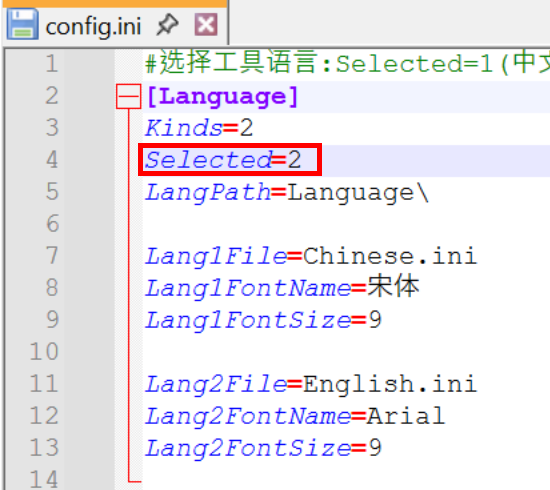

## Mainboard Location

The Q2 mainboard is located on the **upper left side** of the printer, behind a removable cover panel. The USB-C SOC port (position #3 in the motherboard schematic) is accessible after removing this panel.

> [!NOTE]
> The photo in the official Qidi reflash documentation appears to show a different printer model.
>
> 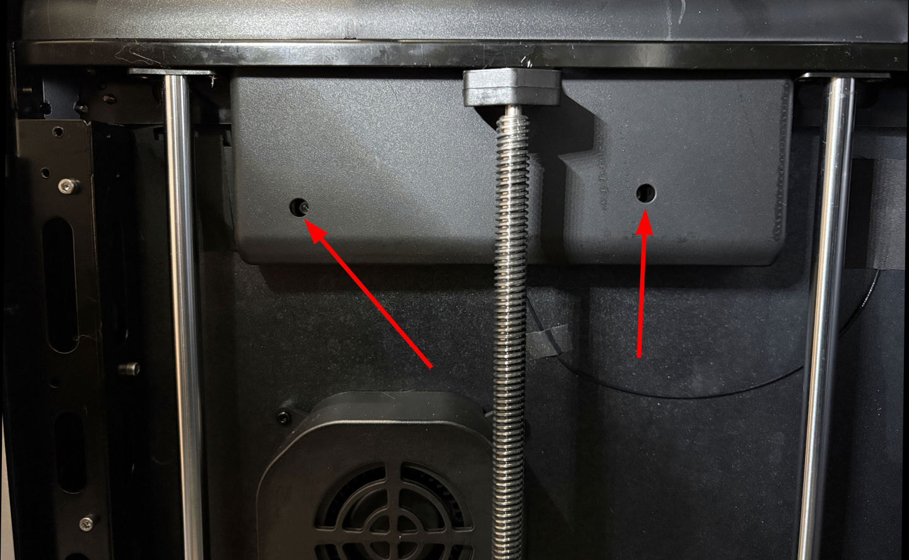
>
> 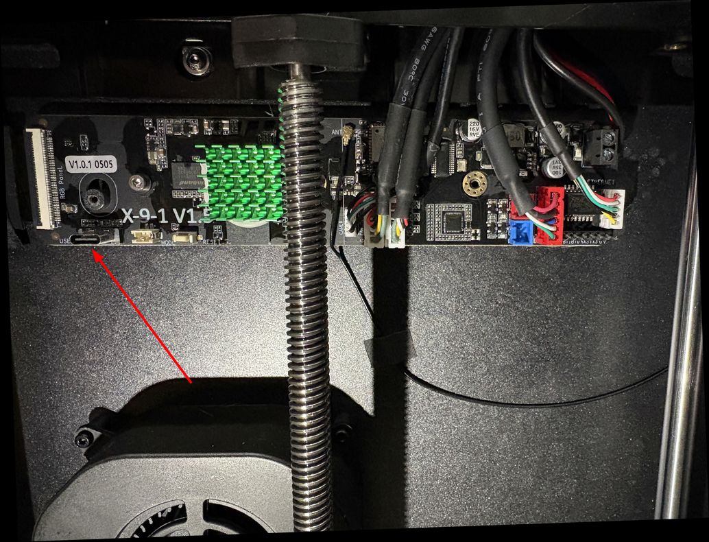

## Procedure

### 1. Install Drivers

- Extract `DriverAssistant_v5.12.zip` and run `DriverInstall.exe`.
- Click **Uninstall Driver** first (to avoid conflicts), then click **Install Driver**.

    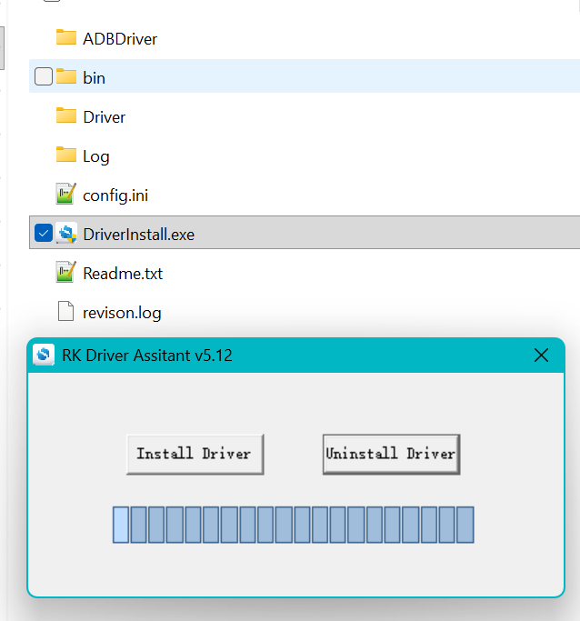

    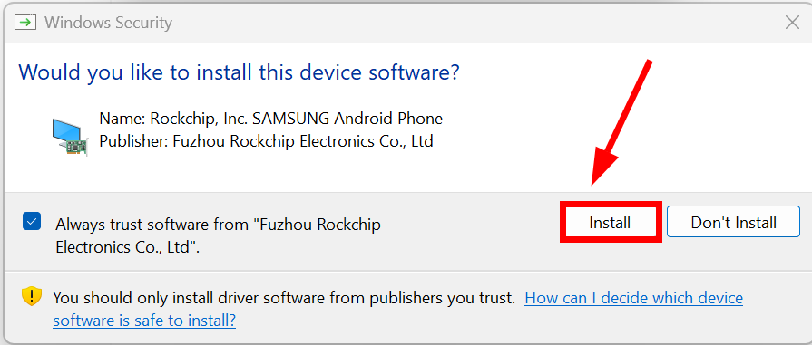

    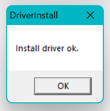


### 2. Open RKDevTool

Extract and launch `RKDevTool.exe` and navigate to the **Upgrade Firmware** tab.


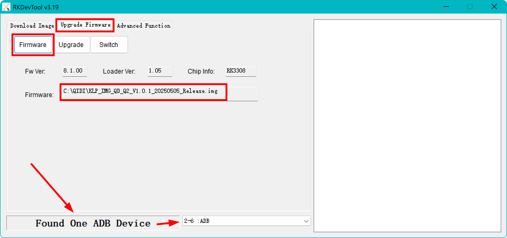


### 3. Select the Firmware Image

Click the folder icon next to the **Firmware** field and select the `.img` file from the extracted firmware package:
```
KLP_IMG_QD_Q2_<version>_Release.img
```

### 4. Connect the Printer

Power on the Q2. Connect the USB-C cable from your PC to the **SOC port on the mainboard** (position #3).

If the connection is successful, RKDevTool will show:
```
ADB device detected
```

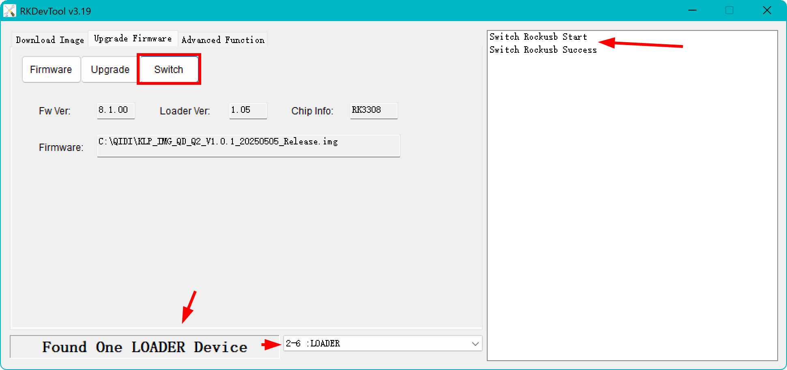

### 5. Switch to Loader Mode

Click the **Switch** button (切换). The device will briefly disconnect and reconnect as a Loader device:
```
LOADER device found
```

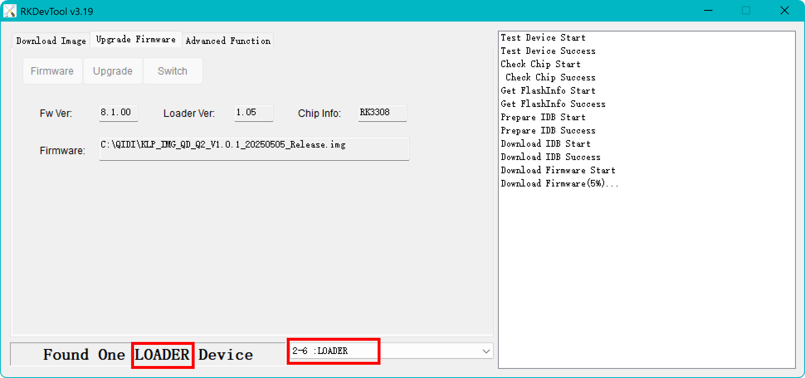


### 6. Flash the Image

Click **Upgrade**. Wait for the progress bar to reach 100%. The tool will confirm success.

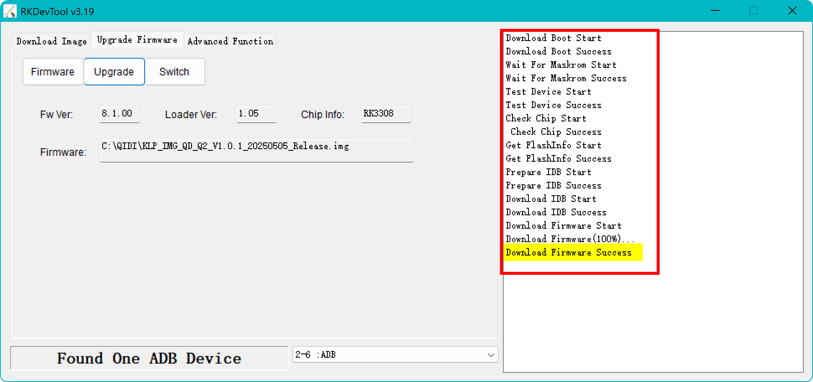

### 7. First Boot After Reflash

The printer will boot into the stock firmware at version **1.0.0** with the **Chinese language UI**. This is expected.

1. Set the language to English (or your preferred language) via the display settings
2. Connect to your WiFi network
3. Perform an **Online Update** via the display to upgrade to the latest firmware version

> [!IMPORTANT]
> After reflashing, all Klipper configuration files are wiped. Restore your printer configuration from your backup before printing.

## Restoring Klipper Configuration

If you have your configuration backed up in a Git repository:

```bash
cd ~/printer_data/config
git init
git remote add origin <your-repo-url>
git pull origin main
```

Then restart Klipper via the web interface (Fluidd/Mainsail).

## Troubleshooting: Maskrom Mode

If the flash is interrupted (e.g. USB disconnect, power loss) or the bootloader becomes corrupted, the Rockchip chip may fall into **Maskrom mode** instead of the normal Loader mode.

**How to identify Maskrom mode:**
- RKDevTool shows `MASKROM device` instead of `LOADER device`

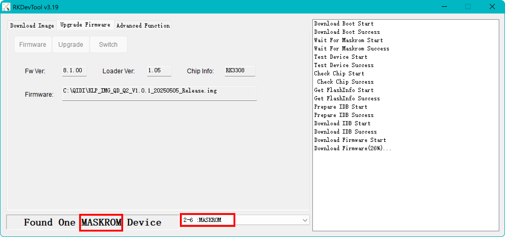

- The Q2 display remains **completely black** (no Qidi logo, no boot animation)

**Maskrom is a low-level recovery mode** built into the Rockchip chip itself. Unlike Loader mode, it does not depend on a working bootloader — the chip listens directly for USB commands from the PC. This means you can still recover from it even if the previous flash was incomplete.

**Recovery procedure from Maskrom mode:**

1. Leave the printer powered on and the USB-C cable connected
2. RKDevTool will show `MASKROM device` in the device list — no Switch step is needed
3. Ensure the correct `.img` file is still selected
4. Click **Upgrade** directly
5. Wait for the progress bar to reach 100%

The flash will complete normally and the printer will reboot into the stock firmware.

## Related

- [Q2 Motherboard Schematic](https://wiki.qidi3d.com/en/Q2/Q2-Motherboard-Schematic)
- [Offline Firmware Update](../manual-update-download/README.md)
